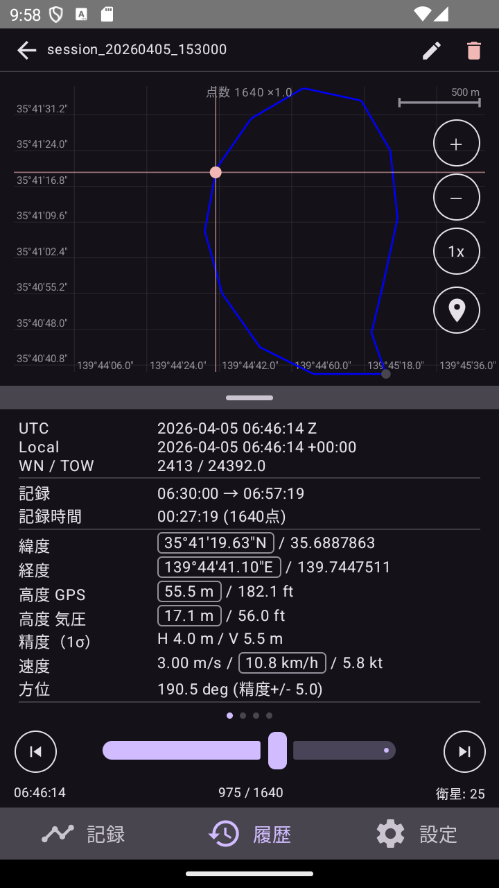
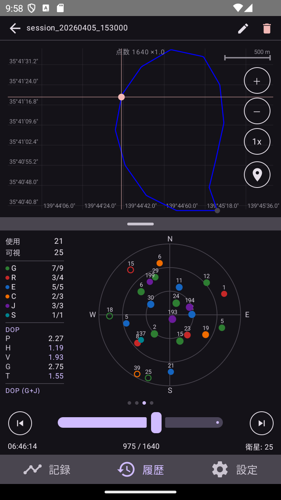
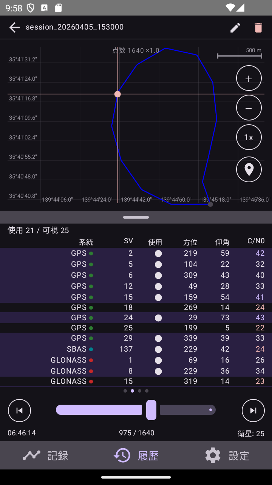
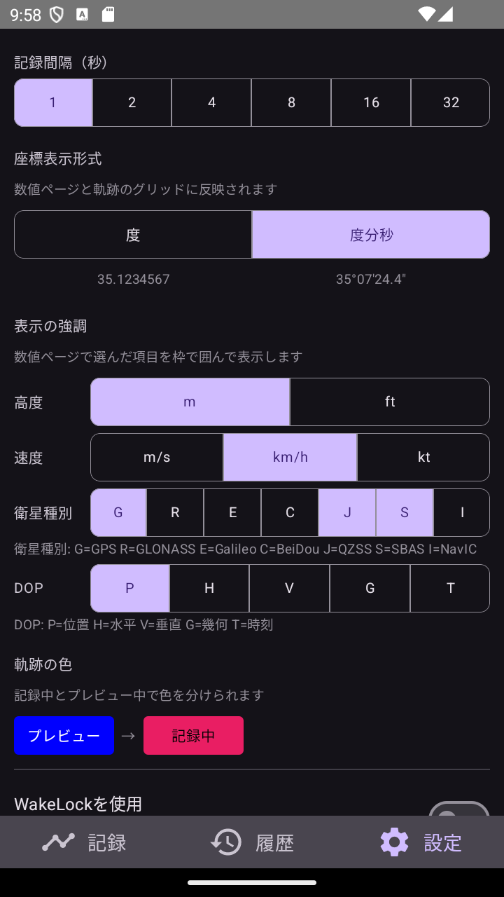

# 現在位置記録アプリ

GNSSの測位結果と衛星の状態を記録するAndroidアプリです。軌跡・数値・衛星情報をその場で表示し、記録したあとは時間軸で振り返れます。

| 軌跡＋数値 | 軌跡＋上空図 |
|---|---|
|  |  |

| 軌跡＋衛星リスト | 設定 |
|---|---|
|  |  |

※スクリーンショットはサンプルデータを再生した画面です。

## 主な機能

- **衛星ごとの記録** — 測位結果に加え、衛星ごとのC/N0・方位角・仰角・キャリア周波数を記録
- **DOP自前計算** — 使用衛星の配置からGDOP/PDOP/HDOP/VDOP/TDOPを算出
- **記録の再生** — 軌跡上の任意の時点まで戻り、そのときの衛星配置や数値を確認
- **気圧高度** — 気圧センサーのある端末では、基準気圧から高度を計算して併記
- **GPX / KMZ の書き出し** — Google Earth などで開ける形式（KMZは点ごとの時刻付き）
- **エクスポート・インポート** — 記録を端末の外に保存し、別の端末へ戻せます
- **バックグラウンド記録** — 画面を閉じても記録を継続
- **日本語・英語対応**

## 動作環境

- Android 8.0（API 26）以降
- GNSS受信機を搭載した端末（気圧高度は気圧センサー搭載端末のみ）※未テスト

## インストール

[Releases](../../releases) からAPKをダウンロードしてインストールしてください。

## 記録されるデータ

1回の記録につき1つのフォルダが作られ、アプリ専用ディレクトリに保存されます。

```
session_20260405_153000/
├── track.csv   測位ログ（1測位＝1行）
├── sats.csv    衛星ログ（1エポック×衛星＝1行）
├── meta.json   記録情報（コメント・タグ・基準気圧・ジオイド高など）
├── track.gpx   任意で書き出し（高度は標高に変換）
└── track.kmz   任意で書き出し（高度は標高に変換）
```

2つのCSVは `elapsed_realtime_ns` で結合でき、任意の測位点における衛星配置を再現できます。
GPX・KMZを書き出すと、同じフォルダに `track.gpx` / `track.kmz` が追加されます。

ご注意：アンインストールするとデータも消えるため、残したい記録はエクスポートしてください。

## ライセンス

Apache License 2.0 の下で公開しています。詳細は [LICENSE](LICENSE) を参照してください。
